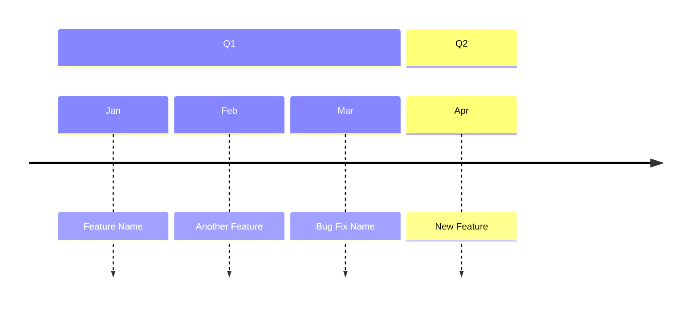

# Brag Document Skill

Evaluate work for brag-worthy accomplishments and maintain a yearly brag document in Obsidian.

## Argument parsing

Parse $ARGUMENTS for one of:
- **Nothing**: Show the current brag document
- **A date**: `today`, `yesterday`, `2026-04-07` - evaluate that day's recap
- **A range**: `last week`, `last month`, `2026-03-01..2026-03-31`, `Q1`, `Q2`, `Q3`, `Q4` - evaluate recaps in that range
- **`backfill`**: Pull from git/GitHub/Monday/sessions for the entire year to date, present candidates for approval

Resolve all dates to YYYY-MM-DD strings. Quarter shortcuts map to: Q1=Jan-Mar, Q2=Apr-Jun, Q3=Jul-Sep, Q4=Oct-Dec of the current year.

## Vault routing

Same routing as the recap skill. Read the vault path from the `OBSIDIAN_VAULT` environment variable and save the brag document to `$OBSIDIAN_VAULT/brag/<year>.md`.

If `$OBSIDIAN_VAULT` is unset, ask the user for a vault path (and point them at the README for how to configure it persistently). Create the `brag/` directory if it doesn't exist. The year is derived from the current date.

## Mode: Show current document (no args)

If no arguments provided:
1. Read and display the current brag document
2. Done - no evaluation needed

## Mode: Evaluate recap(s) (date or range)

### Step 1: Gather recap content

**If recap content is already in the conversation context** (i.e., this was called from the `/recap` skill after it finished writing), use that context directly. Do not re-read the file.

**Otherwise**, read the recap file(s) from disk:
- Single date: read `<vault>/daily-recaps/YYYY-MM-DD.md`
- Range: read all recap files in the date range

If no recap file exists for a given date, skip that date silently.

### Step 2: Read PR descriptions for substance

For any PR mentioned in the recap that looks potentially brag-worthy, **always read the PR description** before writing an entry:

```bash
gh pr view <number> --json title,body --jq '{title: .title, body: .body}'
```

**Critical rules:**
- Never write brag entries from commit messages or git log summaries alone - they lack the "what and why"
- Use the PR author's own framing of the problem and solution as the source of truth
- Verify counts and claims against the PR body - do not inflate (e.g., don't say "5 causes" if the PR says 4)
- If a PR description mentions a feature/behavior, grep the codebase to verify it still exists before including it
- Do not mention file counts or line additions - they are vanity metrics
- The PR link is useful; raw stats are not

### Step 3: Evaluate for brag-worthiness

Apply an **aggressive filter**. Only include items you would actually say in a performance review conversation. Roughly 2-3 items per week at most.

**Brag-worthy:**
- Features shipped that had real user or team impact
- Non-trivial architecture or design decisions that shaped how something was built
- Bug fixes that required deep investigation or had wide blast radius
- PR reviews where you caught real bugs that would have shipped (with evidence from replies showing the author adopted the fix)
- Tooling or process improvements that changed how the team works
- Cases resolved (count + links)

**Not brag-worthy:**
- Routine git operations (rebasing, merging, branch cleanup)
- Minor formatting or styling fixes
- Running a skill (the outcome might be brag-worthy, not the invocation)
- Generating recaps or other meta-tasks
- Work that was identified as a direction but not actually shipped
- Small config changes unless they unblocked something critical

### Step 4: Categorize entries

Categories:
- **Impact** - features shipped, bugs fixed with real user/team impact
- **Collaboration** - PR reviews where you caught something meaningful (with evidence), helping teammates unblock
- **Tooling & Process** - skills built, workflow improvements, tooling RFCs
- **Cases Resolved** - running count + links to Monday cases (only include this category if Monday MCP is configured)

Only use a category if there are entries for it. If an architecture decision is what made a feature work well, fold it into the Impact entry rather than creating a separate Architecture category.

### Step 5: Check for duplicates

Before appending, read the current brag document and check:
- Do any existing entries reference the same PR numbers?
- Do any existing entries reference the same commit hashes?

If a duplicate is found, skip that entry. For collaboration entries (PR review counts), update the running total rather than adding a new line.

### Step 6: Determine the quarter

Derive from the date: Q1=Jan-Mar, Q2=Apr-Jun, Q3=Jul-Sep, Q4=Oct-Dec.

### Step 7: Append to the brag document

Read the current brag document. For each new entry:
1. Find the correct category section (create if it doesn't exist)
2. Find or create the correct quarter subsection (### Q1, ### Q2, etc.)
3. Append the entry under the correct quarter

**Entry format:**
```markdown
- **Short bold title** (Mon DD) - Description of what was done, why it mattered, and what the outcome was. [#123](url) | [[daily-recaps/YYYY-MM-DD|Mon DD recap]]
```

The `[[daily-recaps/...]]` wikilink connects the brag entry back to the daily recap for full context. Only include this backlink if a recap exists for that date.

For Cases Resolved, append new cases to the list inside the `> [!bug]` callout and update the running total and progress bar.

### Step 8: Update the summary callout

After appending entries, update the `> [!tip] 2026 at a glance` callout at the top:
- Recount features shipped, PRs reviewed, cases resolved, tooling improvements
- Update the progress bar if cases changed

### Step 9: Update the timeline diagram

If a new feature was added to Impact or a notable bug was fixed, add it to the Mermaid timeline diagram. The timeline groups events by quarter and month:



Add the entry under the correct quarter and month. Keep entries concise (short title only).

### Step 10: Print summary

After writing, print a short summary of what was added. Format:

```
Brag update: Added N entries to brag/<year>.md
  - <Category>: <one-liner for each entry>
```

If nothing was brag-worthy, print:
```
Brag update: No brag-worthy items found for <date/range>.
```

Do **not** ask for approval when called from recap. Just append and summarize.

## Mode: Backfill

For periods where no daily recaps exist, gather data from raw sources:

1. **Git log** for the date range (commits by the user)
2. **GitHub PRs** authored and reviewed in the range
3. **Monday.com** (optional, only if the Monday MCP is configured): look up the user's Monday user ID via `get_user_context`, then query the user's cases board for items resolved/closed in the range. The board ID is project-specific — ask the user for it the first time, and remember it in `$MONDAY_CASES_BOARD_ID` or similar if they want it persisted.
4. **Claude session transcripts** - selectively, only for weeks identified as notable from the other sources

For backfill mode:
- Use git/PR (and optionally Monday) to identify notable weeks first
- Only read session transcripts from those notable weeks for additional context
- **Present all candidates to the user for approval before writing** (unlike recap-triggered mode)
- Group candidates by category and quarter for easy review

## Document structure

The brag document uses this Obsidian-optimized structure:

```markdown
---
tags:
  - brag
  - <year>
  - performance-review
---

# Brag Document - <year>

> [!tip] <year> at a glance
> **N** features shipped | **N** PRs reviewed | **N** cases resolved | **N** tooling improvements
>
> <progress value="N" max="N"></progress> N/N cases resolved

` ` `mermaid
timeline
    title <year>
    section Q1
        Jan : Feature Name
        Feb : Another Feature
    section Q2
        Apr : New Feature
            : Bug Fix Name
` ` `

> [!success]- Impact (N)

### Q1
- entries...

### Q2
- entries...

> [!example]- Collaboration (N PRs reviewed)

### Q1
- entries...

### Notable catches that led to code changes
- entries...

> [!gear]- Tooling & Process (N)

### Q1
- entries...

> [!bug]- Cases Resolved (N)
> <progress value="N" max="N"></progress> N/N
>
> **Q1 (N)**
> - [Case name](monday-url) (Mon)
>
> **Q2 (N)**
> - [Case name](monday-url) (Mon)
```

Note: The triple backticks for the mermaid block above are escaped with spaces. In actual output, use proper triple backticks with no spaces.
