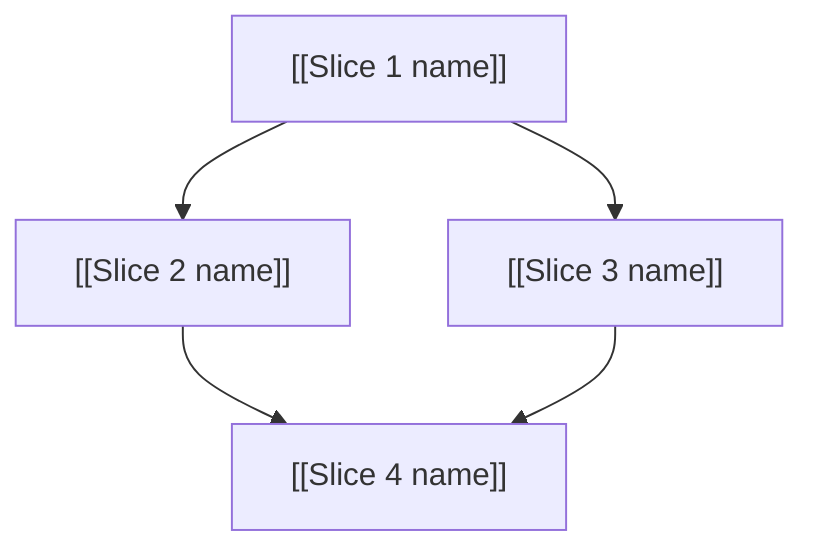

# PRD to Slices

Break a PRD into independently-grabbable vertical slices (tracer bullets), saved as linked Obsidian notes.

## Process

### 1. Locate the PRD

Ask the user which PRD to break down. Look for it in `$OBSIDIAN_VAULT/PRDs/` (the Obsidian vault configured via the `OBSIDIAN_VAULT` env var — see the repo README). If the PRD is not already in your context window, read it.

### 2. Explore the codebase (optional)

If you have not already explored the codebase, do so to understand the current state of the code.

### 3. Draft vertical slices

Break the PRD into **tracer bullet** slices. Each slice is a thin vertical cut through ALL integration layers end-to-end, NOT a horizontal slice of one layer.

Slices may be 'HITL' or 'AFK'. HITL slices require human interaction, such as an architectural decision or a design review. AFK slices can be implemented and merged without human interaction. Prefer AFK over HITL where possible.

<vertical-slice-rules>
- Each slice delivers a narrow but COMPLETE path through every layer (schema, API, UI, tests)
- A completed slice is demoable or verifiable on its own
- Prefer many thin slices over few thick ones
</vertical-slice-rules>

### 4. Quiz the user

Present the proposed breakdown as a numbered list. For each slice, show:

- **Title**: short descriptive name
- **Type**: HITL / AFK
- **Blocked by**: which other slices (if any) must complete first
- **User stories covered**: which user stories from the PRD this addresses

Ask the user:

- Does the granularity feel right? (too coarse / too fine)
- Are the dependency relationships correct?
- Should any slices be merged or split further?
- Are the correct slices marked as HITL and AFK?

Iterate until the user approves the breakdown.

### 5. Create the Obsidian notes

The PRD lives in a folder like `$OBSIDIAN_VAULT/PRDs/<feature-name>/`. Create each slice as a note inside that same folder.

**Create slices in dependency order** (blockers first) so you can wiki-link to real slice names in the "Blocked by" field.

Use this template for each slice note:

<slice-template>
---
type: slice
status: todo
slice-type: <HITL or AFK>
parent-prd: "[[PRD - <feature name>]]"
blocked-by:
  - "[[<blocker slice filename without .md>]]"
user-stories:
  - <number from parent PRD>
created: <today's date YYYY-MM-DD>
tags:
  - slice
  - <same feature-area tag as the PRD>
  - <hitl or afk>
---

## Parent PRD

[[PRD - <feature name>]]

## What to build

A concise description of this vertical slice. Describe the end-to-end behavior, not layer-by-layer implementation. Reference specific sections of the parent PRD rather than duplicating content.

## Acceptance criteria

- [ ] Criterion 1
- [ ] Criterion 2
- [ ] Criterion 3

## Blocked by

- [[<blocker slice name>]] (describe why)

Or "None -- can start immediately" if no blockers.

## User stories addressed

From [[PRD - <feature name>]]:

- User story 3
- User story 7

</slice-template>

### 6. Create a dependency graph note

Create a note called `Dependency Graph.md` in the same PRD folder. This gives a visual overview of the slice ordering.

<dependency-graph-template>
---
type: dependency-graph
parent-prd: "[[PRD - <feature name>]]"
created: <today's date YYYY-MM-DD>
tags:
  - dependency-graph
  - <same feature-area tag as the PRD>
---

## Dependency Graph

[[PRD - <feature name>]]



## Slice index

| Slice | Type | Status | Blocked by |
|-------|------|--------|------------|
| [[Slice 1 name]] | AFK | todo | None |
| [[Slice 2 name]] | AFK | todo | [[Slice 1 name]] |
| [[Slice 3 name]] | HITL | todo | [[Slice 1 name]] |
| [[Slice 4 name]] | AFK | todo | [[Slice 2 name]], [[Slice 3 name]] |

</dependency-graph-template>

### 7. Update the parent PRD

Add wiki links to all created slices in the PRD's `## Slices` section:

```markdown
## Slices

- [[Slice 1 name]] (AFK)
- [[Slice 2 name]] (AFK, blocked by Slice 1)
- [[Slice 3 name]] (HITL, blocked by Slice 1)
- [[Slice 4 name]] (AFK, blocked by Slice 2 + 3)

See [[Dependency Graph]] for visual overview.
```

Do NOT modify any other section of the parent PRD.
